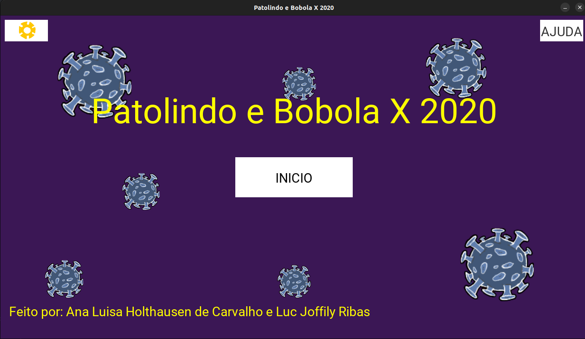
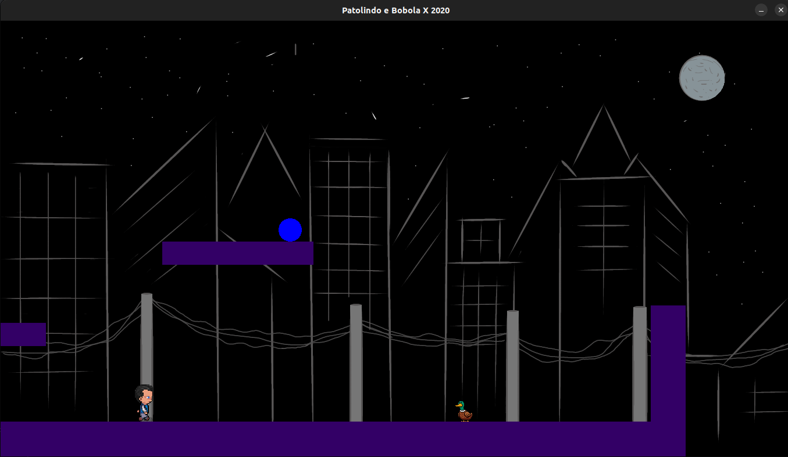
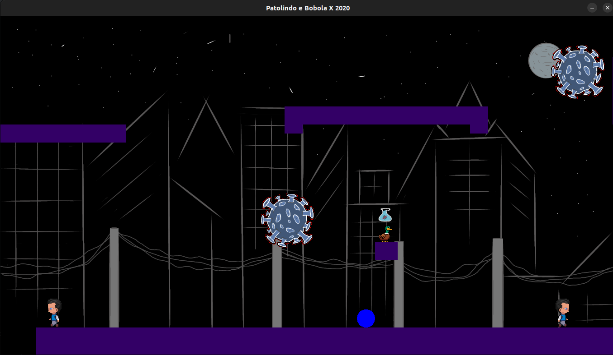
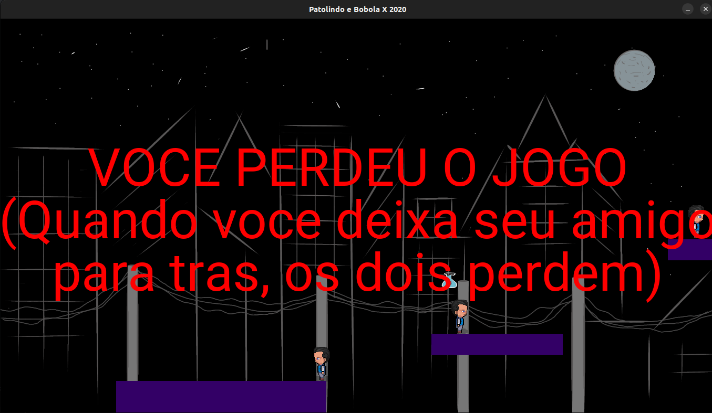
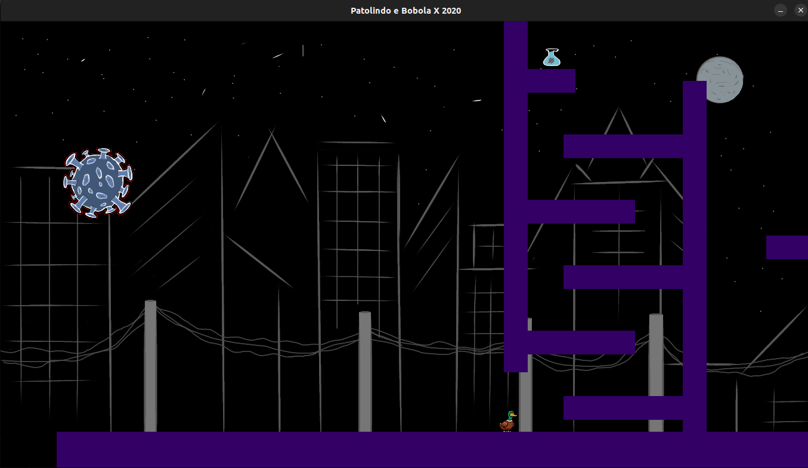
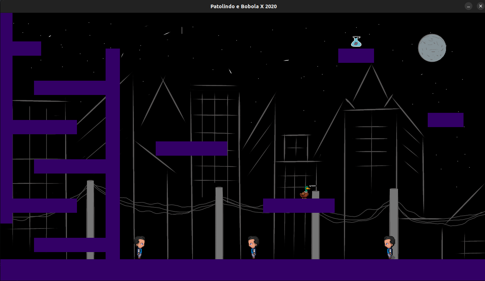
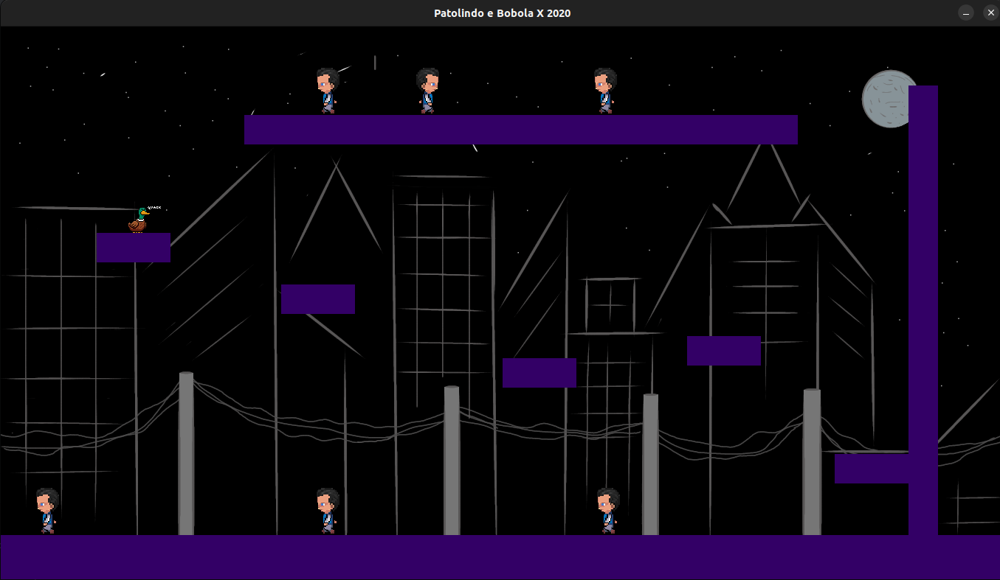

# Patolindo and Bobola VS 2020

This is a game developed for a C programing class, using the allegro library.
In this game a duck and a ball have to move past the Corona viruses and people without masks
to scape 2020.

You can move with the character, shout to change the maskless people's direction
and collect and use alcohol gel to kill corona viruses.
Press the "AJUDA" button to see the controls.

The game used to have a server to save the high score globally, but the server expired.

## Screenshots

## Authors

- Ana Luisa Holthausen de Carvalho ([github](https://github.com/holtanalu))
- Luc Joffily Ribas ([github](https://github.com/Luc16))
